# RN-Chat
基于React Native的仿微信客户端，目前只有安卓版本

# 组成
- 客户端：React Native，mobX，网易云信SDK
- 服务端：NodeJS(Express)，阿里云服务器
- 数据库：Mysql

# 第三方库
- react-native-camera
- tiny-pinyin
- react-native-easy-toast
- react-native-image-crop-picker
- react-native-simple-radio-button
- react-native-storage
- react-native-vector-icons
- react-navigation

# 运行
### 1、进入项目目录
```
yarn
```
or
```
npm install
```

### 2、在终端输入：
```
react-native start --reset-cache
```

### 3、等待上一条指令运行完成，另开一个终端，输入：
```
react-native run-android
```

# 功能
###1、已完成功能
- 登录注册
- 单聊、群聊(测试中)
- 添加黑名单、添加静音列表
- 添加好友、删除好友、接受好友请求、拒绝好友请求
- 修改用户名、修改个性签名、修改个人头像(测试中)

###2、待完成功能
- 朋友圈
- 发送图片、语音、位置


# 运行界面

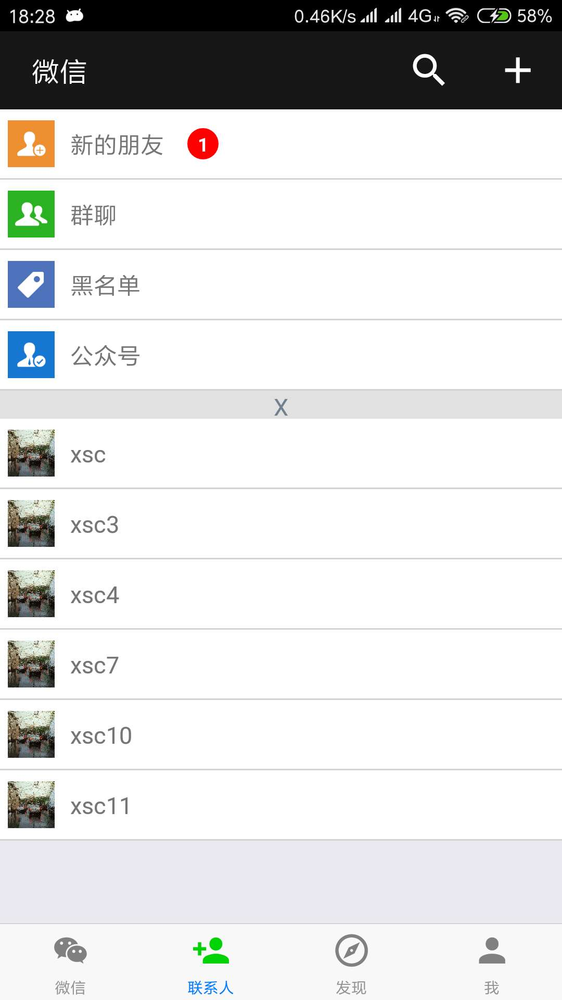

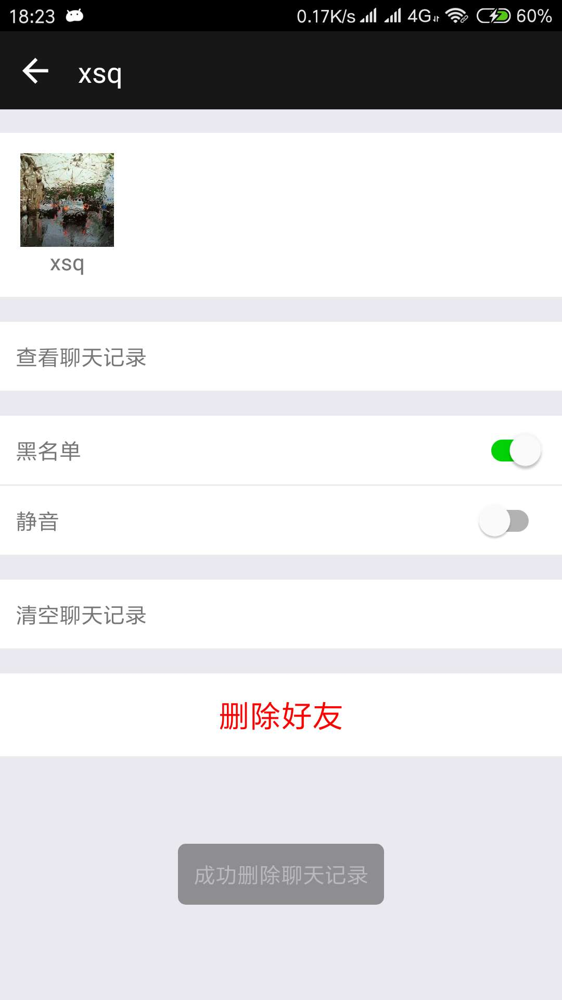


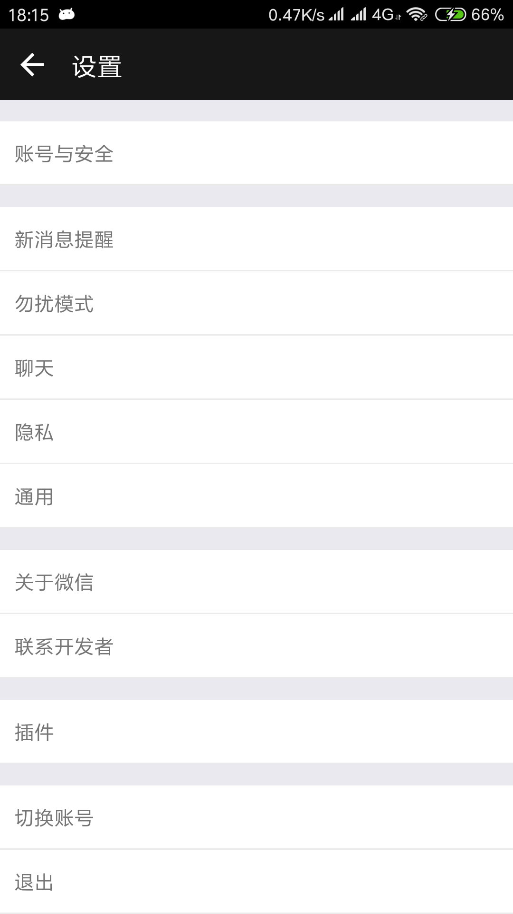
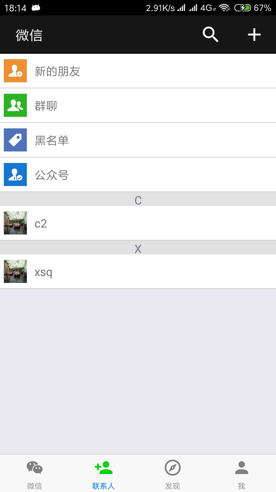
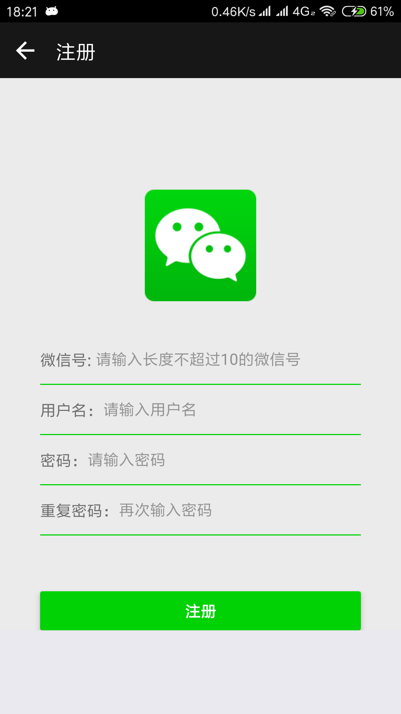
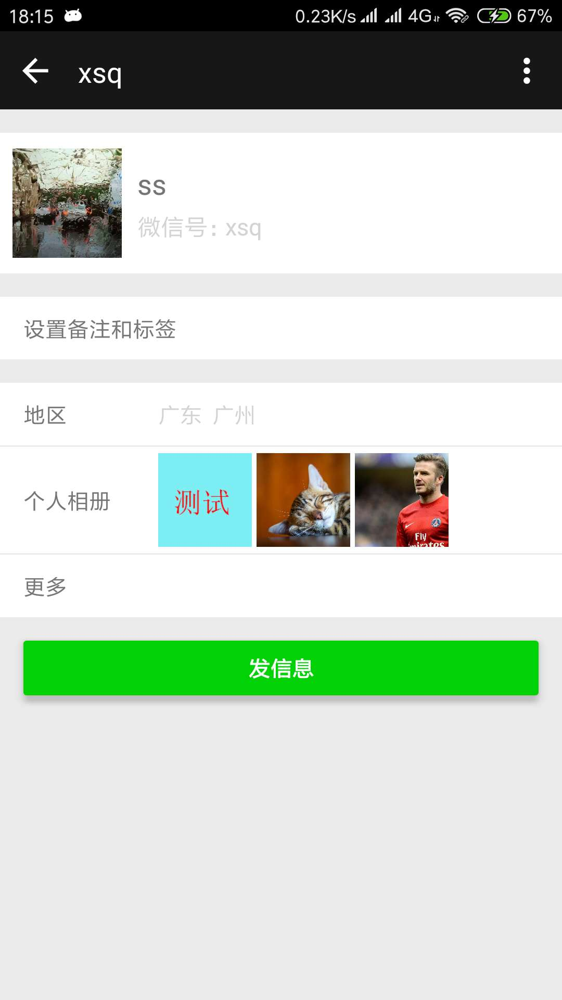
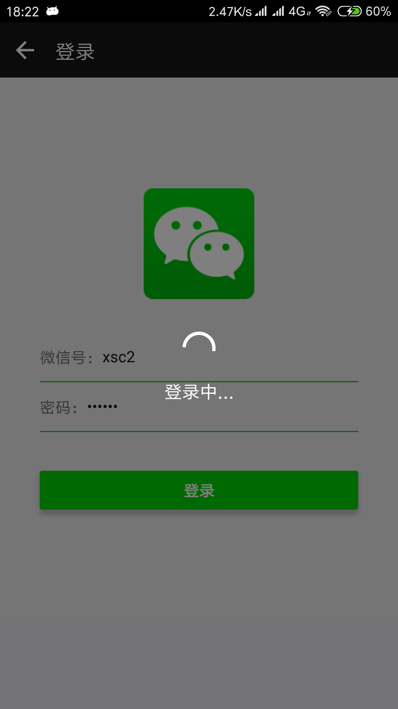
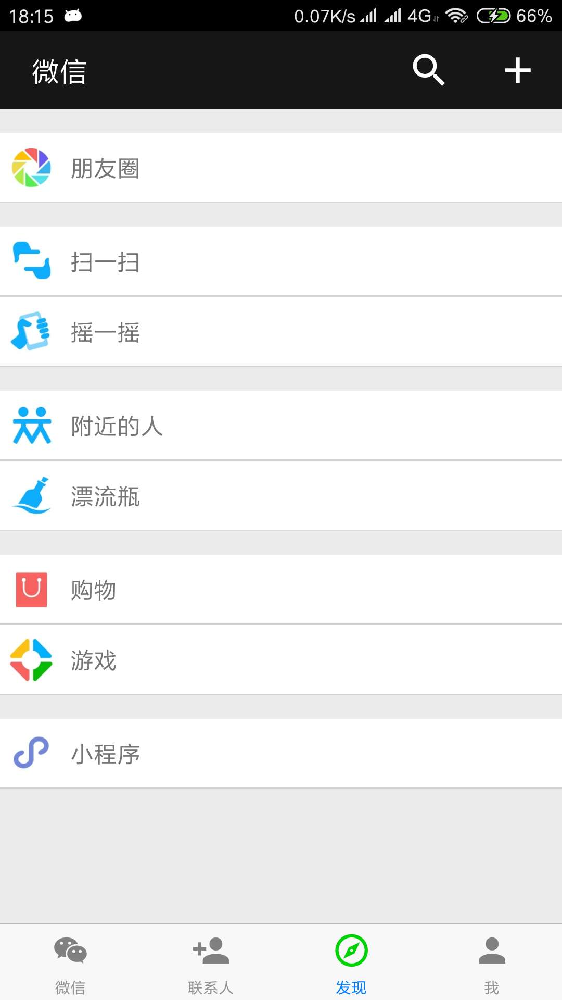
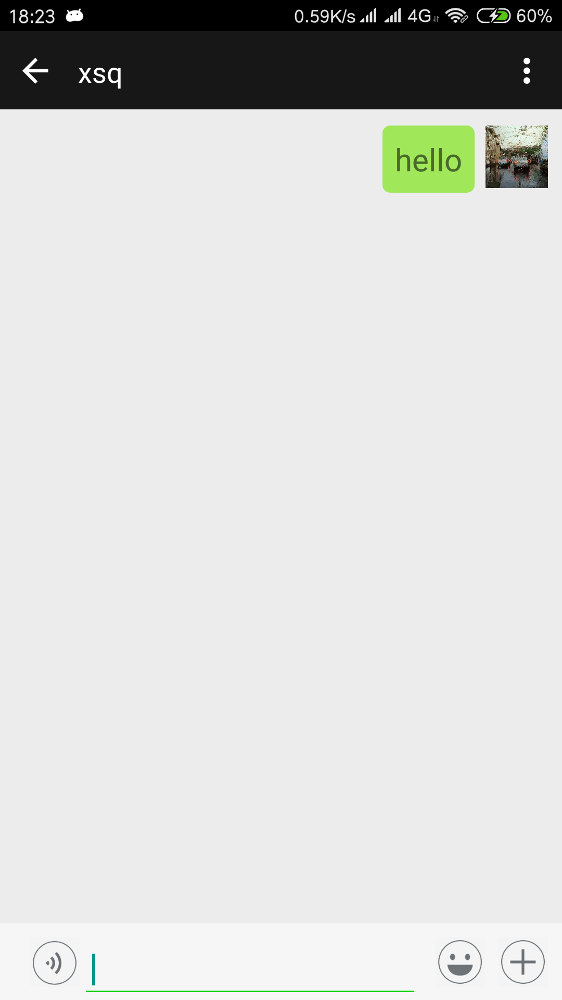
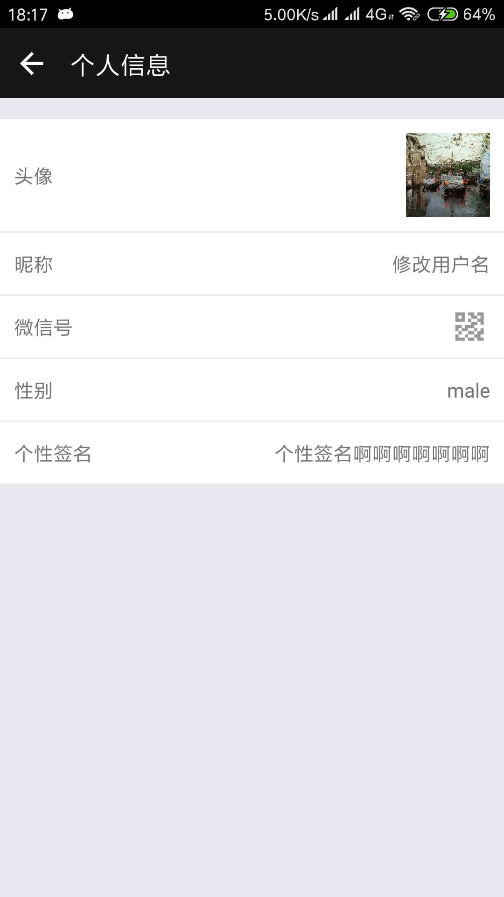
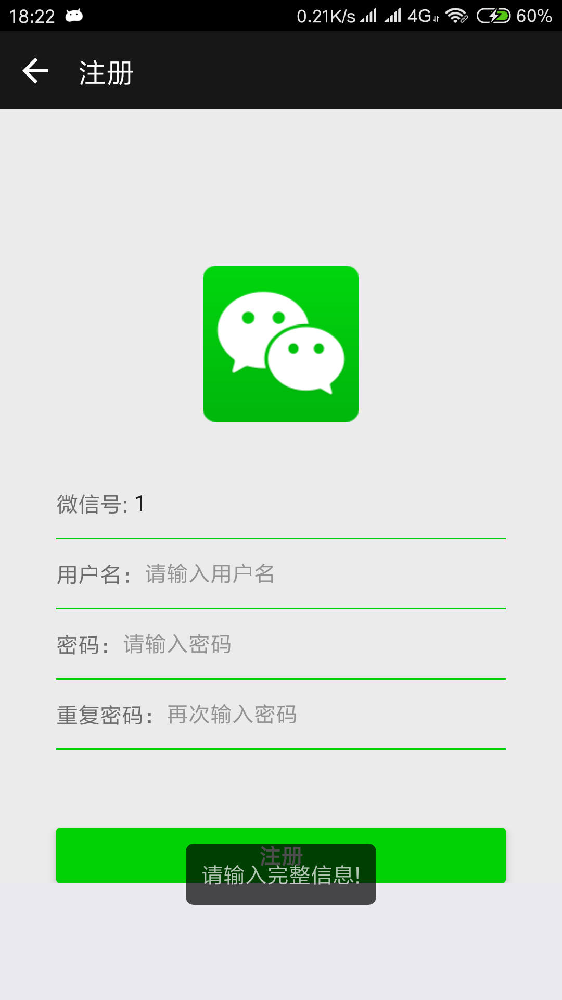
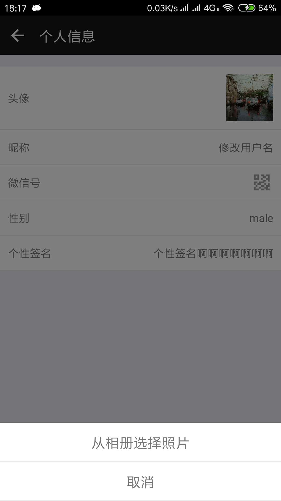
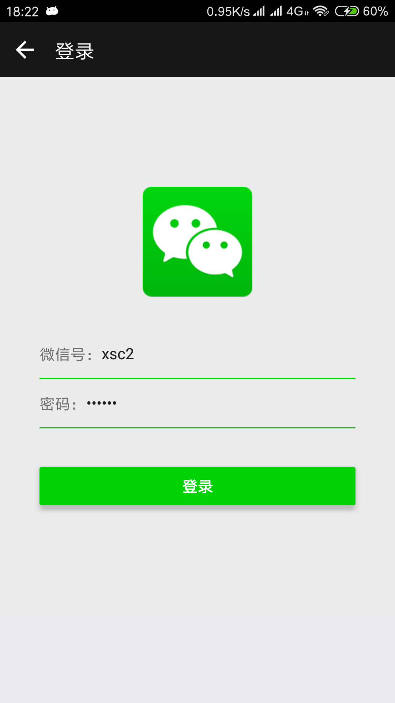

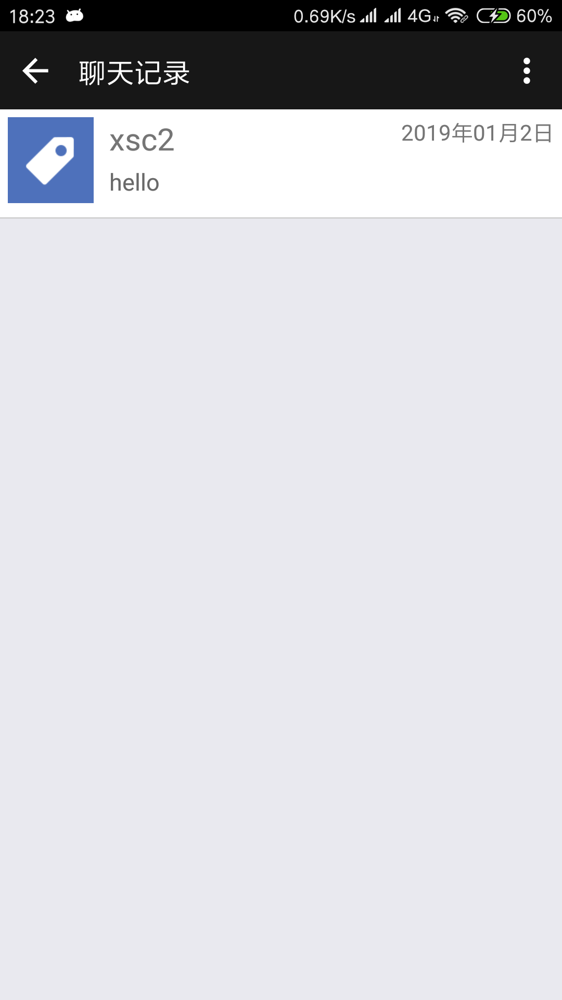


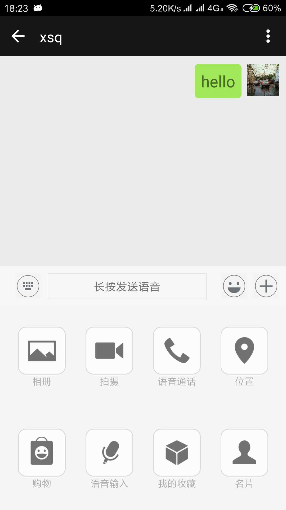

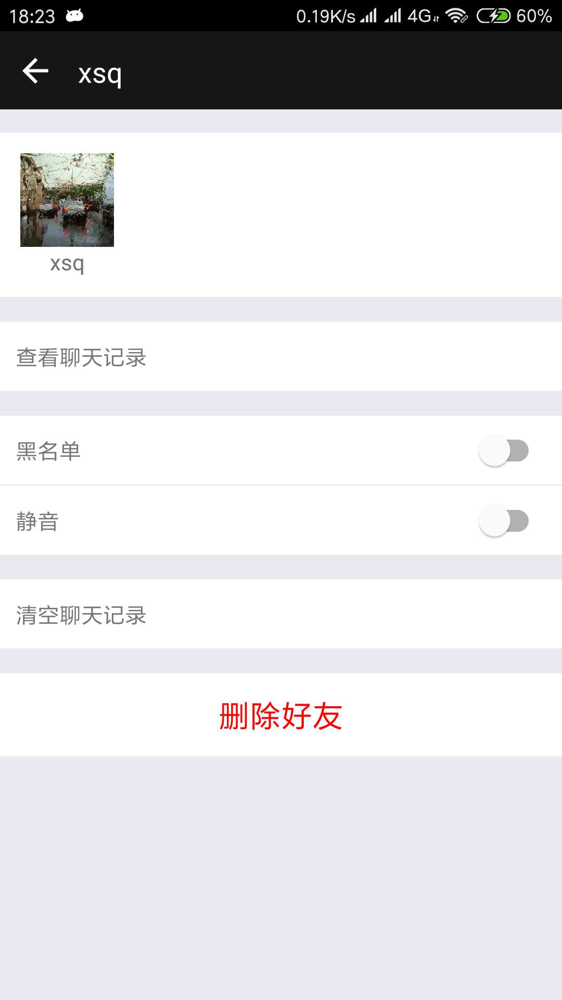

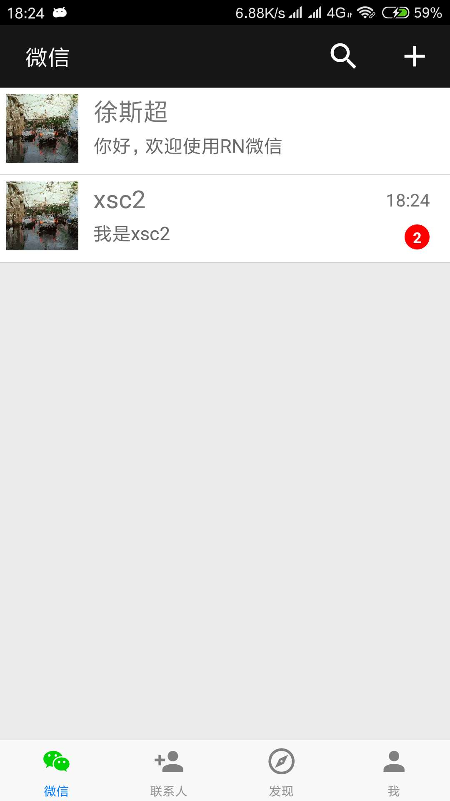


# 注意事项
因为SDK用的是网易云信SDK，貌似有好友上限为100这个限制，超过的话会无法发送信息，过年期间我估计会重写这个项目(太混乱了...)，到时候我会找找有没有其他的SDK可用

# 结语
这个项目是一开始接触RN时想找一个有难度，然后又不至于被打击的项目来练练手而开始的，时间大约是2018-11月份吧，断断续续做了大概一个月(十二月份有点事所以暂停了)，期间踩到的坑也不少，不过很可惜当时没有写技术博客的习惯，有一部分环境搭建的坑没来得及记录(不过现在有简书了(https://www.jianshu.com/u/e27136c5b3bb))，总体而言，该项目还有很多需要完善的地方，我会尽快将它完成。如果你觉得不错，可以star⭐一下，谢谢~


